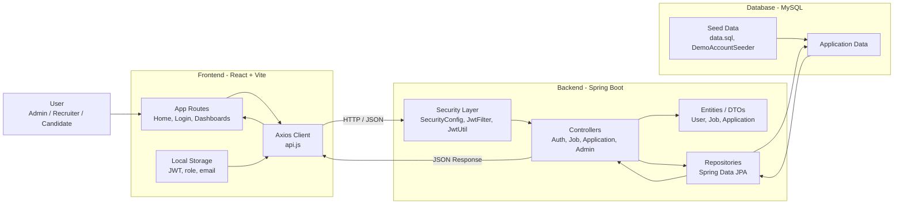

# Online Job Portal

This is a full-stack Job Portal built with Java 21, Spring Boot, MySQL, React, and Vite. It supports role-based login, job browsing, recruiter job management, candidate applications, and Swagger API testing.

## Features

### Backend
- JWT authentication with role-based access
- Public job listing and job details APIs
- Candidate application APIs
- Recruiter job posting, applicant review, status update, and delete APIs
- Swagger / OpenAPI support
- SQL-based startup data seeding

### Frontend
- Separate login pages for `ADMIN`, `RECRUITER`, and `CANDIDATE`
- Candidate application tracking page
- Recruiter dashboard with applicant management
- Route protection by role
- Job search, location filter, and sorting

## Roles

- `ADMIN`
  Can access the admin dashboard, view platform stats, manage users, delete jobs, and review applications.

- `RECRUITER`
  Can post jobs, view their jobs, open applicants, update application status, and delete jobs without applications.

- `CANDIDATE`
  Can browse jobs, apply to jobs, and track applications.

## Default SQL Data

Startup seed data is stored in [`backend/src/main/resources/data.sql`](C:\Users\rajku\OneDrive\Desktop\Job%20Portal\backend\src\main\resources\data.sql).

Default accounts:

- Email: `admin@test.com`
- Password: `123456`
- Role: `ADMIN`

- Email: `recruiter@test.com`
- Password: `123456`
- Role: `RECRUITER`

- Email: `candidate@test.com`
- Password: `123456`
- Role: `CANDIDATE`

Default jobs inserted on startup:

- Frontend Developer
- Backend Java Engineer
- Full Stack Developer
- UI/UX Designer
- DevOps Engineer
- Data Analyst
- QA Engineer
- Product Manager
- Mobile App Developer

These records are inserted only if they do not already exist.

## Separate Login Pages

- Login selector: `http://127.0.0.1:5173/login`
- Admin login: `http://127.0.0.1:5173/login/admin`
- Recruiter login: `http://127.0.0.1:5173/login/recruiter`
- Candidate login: `http://127.0.0.1:5173/login/candidate`

## Project Structure

```text
Job Portal/
|-- backend/
|   |-- src/main/java/com/jobportal/
|   |   |-- controller/
|   |   |-- dto/
|   |   |-- entity/
|   |   |-- exception/
|   |   |-- repository/
|   |   |-- security/
|   |-- src/main/resources/
|   |   |-- application.properties
|   |   |-- data.sql
|   |-- pom.xml
|-- frontend/
|   |-- src/
|   |   |-- components/
|   |   |-- pages/
|   |-- package.json
|-- README.md
|-- PROJECT_DOCUMENTATION.md
```

## Prerequisites

- Java 21
- MySQL running on `localhost:3306`
- Node.js and npm
- Maven

Create the database:

```sql
CREATE DATABASE job_portal;
```

Update [`backend/src/main/resources/application.properties`](C:\Users\rajku\OneDrive\Desktop\Job%20Portal\backend\src\main\resources\application.properties) if your MySQL username or password is different.

## Run The Project

### Backend

```powershell
cd "C:\Users\rajku\OneDrive\Desktop\Job Portal\backend"
mvn clean install
mvn spring-boot:run
```

### Frontend

```powershell
cd "C:\Users\rajku\OneDrive\Desktop\Job Portal\frontend"
cmd /c npm install
cmd /c npm run dev
```

## Deployment Prep

The project is now environment-variable ready.

Frontend:

- Copy [`frontend/.env.example`](C:\Users\rajku\OneDrive\Desktop\Job%20Portal\frontend\.env.example)
- Set `VITE_API_BASE_URL` to your deployed backend API URL

Backend:

- Copy [`backend/.env.example`](C:\Users\rajku\OneDrive\Desktop\Job%20Portal\backend\.env.example)
- Set your production values for:
  - `SPRING_DATASOURCE_URL`
  - `SPRING_DATASOURCE_USERNAME`
  - `SPRING_DATASOURCE_PASSWORD`
  - `JWT_SECRET`
  - `APP_CORS_ALLOWED_ORIGINS`

Production recommendation:

- Set `SPRING_SQL_INIT_MODE=never` in production if you do not want demo users and demo jobs seeded.
- Set `SPRING_JPA_SHOW_SQL=false` in production.
- Use a strong random `JWT_SECRET`.

## Deployment Steps

### Backend

```powershell
cd "C:\Users\rajku\OneDrive\Desktop\Job Portal\backend"
mvn clean package
java -jar target/backend-0.0.1-SNAPSHOT.jar
```

### Frontend

```powershell
cd "C:\Users\rajku\OneDrive\Desktop\Job Portal\frontend"
cmd /c npm install
cmd /c npm run build
```

Deploy the generated `dist` folder to static hosting such as Vercel or Netlify.

## Important URLs

- Frontend: `http://127.0.0.1:5173`
- Backend root: `http://localhost:8080`
- Swagger UI: `http://localhost:8080/swagger-ui.html`
- OpenAPI JSON: `http://localhost:8080/v3/api-docs`
- Jobs API: `http://localhost:8080/api/jobs`

## API Endpoints

### Public
- `GET /`
- `POST /api/auth/register`
- `POST /api/auth/login`
- `GET /api/jobs`
- `GET /api/jobs/{id}`

### Candidate
- `POST /api/applications`
- `GET /api/applications/my-applications`

### Recruiter
- `POST /api/jobs`
- `GET /api/jobs/my-jobs`
- `DELETE /api/jobs/{id}`
- `GET /api/applications/job/{jobId}`
- `PUT /api/applications/{applicationId}/status`

### Admin
- `GET /api/admin/stats`
- `GET /api/admin/users`
- `PUT /api/admin/users/{id}/role`
- `DELETE /api/admin/users/{id}`
- `GET /api/admin/jobs`
- `DELETE /api/admin/jobs/{id}`
- `GET /api/admin/applications`

## Sample Payloads

Register:

```json
{
  "name": "Raj Kumar",
  "email": "raj@test.com",
  "password": "123456",
  "role": "CANDIDATE"
}
```

Login:

```json
{
  "email": "recruiter@test.com",
  "password": "123456"
}
```

Create job:

```json
{
  "title": "Java Developer",
  "description": "Spring Boot developer required",
  "location": "Bangalore",
  "salary": 800000,
  "company": "ABC Tech"
}
```

Apply to job:

```json
{
  "jobId": 1,
  "resumeUrl": "https://example.com/resume.pdf"
}
```

Update application status:

```json
{
  "status": "REVIEWED"
}
```

## How To Test

1. Start backend and frontend.
2. Open `http://localhost:8080/api/jobs` and confirm default jobs are returned.
3. Open `http://127.0.0.1:5173`.
4. Log in as recruiter with `recruiter@test.com / 123456`.
5. Register a candidate account from the frontend.
6. Log in as candidate and apply to a job.
7. Log back in as recruiter and review applicants.

## Notes

- The frontend fetches jobs from the backend API, so the backend must be running to display seeded jobs.
- The current docs and routes assume demo accounts and seeded jobs are enabled. Set `SPRING_SQL_INIT_MODE=never` in production if you do not want that behavior.

## Architecture

This project follows a simple full-stack client-server architecture:

- `Frontend`
  [`frontend`](C:\Users\rajku\OneDrive\Desktop\Job%20Portal\frontend) is a React + Vite single-page application.
  It handles routing, role-based page access, login state, dashboards, and job browsing.

- `API Client`
  [`frontend/src/api.js`](C:\Users\rajku\OneDrive\Desktop\Job%20Portal\frontend\src\api.js) is the shared Axios client.
  It reads `VITE_API_BASE_URL` and automatically attaches the JWT token from `localStorage`.

- `Backend`
  [`backend`](C:\Users\rajku\OneDrive\Desktop\Job%20Portal\backend) is a Spring Boot REST API.
  It exposes authentication, jobs, applications, admin, and Swagger endpoints.

- `Security Layer`
  [`SecurityConfig.java`](C:\Users\rajku\OneDrive\Desktop\Job%20Portal\backend\src\main\java\com\jobportal\security\SecurityConfig.java), [`JwtFilter.java`](C:\Users\rajku\OneDrive\Desktop\Job%20Portal\backend\src\main\java\com\jobportal\security\JwtFilter.java), and [`JwtUtil.java`](C:\Users\rajku\OneDrive\Desktop\Job%20Portal\backend\src\main\java\com\jobportal\security\JwtUtil.java) manage stateless JWT authentication and role-based authorization.

- `Controller Layer`
  Controllers in [`backend/src/main/java/com/jobportal/controller`](C:\Users\rajku\OneDrive\Desktop\Job%20Portal\backend\src\main\java\com\jobportal\controller) handle incoming HTTP requests and map them to business actions.

- `Persistence Layer`
  Entities in [`backend/src/main/java/com/jobportal/entity`](C:\Users\rajku\OneDrive\Desktop\Job%20Portal\backend\src\main\java\com\jobportal\entity) model users, jobs, and applications.
  Repositories in [`backend/src/main/java/com/jobportal/repository`](C:\Users\rajku\OneDrive\Desktop\Job%20Portal\backend\src\main\java\com\jobportal\repository) provide database access through Spring Data JPA.

- `Database`
  MySQL stores application data.
  Seed users and demo jobs are initialized through [`data.sql`](C:\Users\rajku\OneDrive\Desktop\Job%20Portal\backend\src\main\resources\data.sql) and demo account alignment in [`DemoAccountSeeder.java`](C:\Users\rajku\OneDrive\Desktop\Job%20Portal\backend\src\main\java\com\jobportal\config\DemoAccountSeeder.java).

### Architecture Diagram



### Request Flow

1. A user interacts with the React frontend.
2. The frontend sends API requests through Axios to the Spring Boot backend.
3. Protected requests include the JWT token in the `Authorization` header.
4. Spring Security validates the token and checks the user role.
5. Controllers call repositories to read or update MySQL data.
6. JSON responses are returned to the frontend and rendered in the UI.
